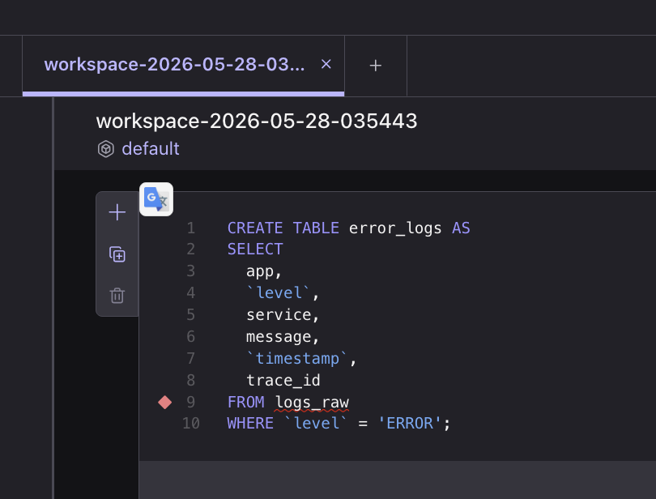
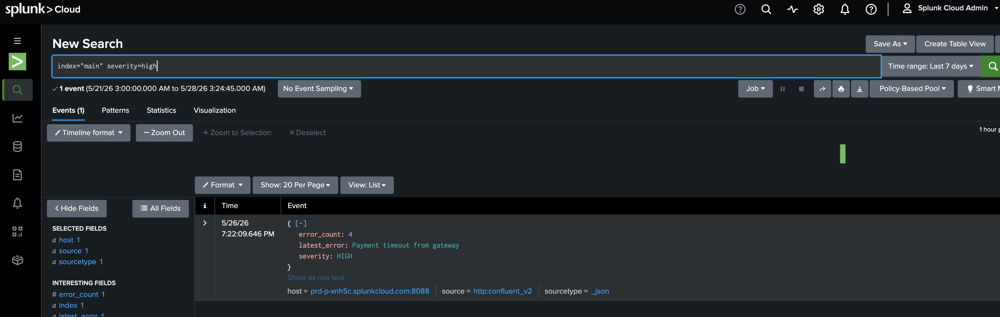

# CONFLUENT CLOUD Hackathon
This was the hackathon project based on confluent cloud, kafka, flink, AI 

# OpsPilot: AI-Powered Streaming Incident Investigator

> Hackathon project built on Confluent Cloud to detect production anomalies from real-time logs, explain incidents in simple English, and push actionable incident summaries into Splunk dashboards.

## Hackathon Context

This project was built as part of a Confluent hackathon challenge focused on:

**Problem Statement:**  
Use data streaming to build the **Most Impactful AI App**.

**Submission Requirements:**

- Use Confluent connectors
- Use stream processing
- Use Stream Governance with Schema Registry
- Demonstrate real-time AI-powered impact

The Confluent organizers provided Azure API keys and MCP server keys for the workshop setup. I used the Confluent Cloud environment with **$400 free credits** to run the hackathon application.

---

## Project Overview

**OpsPilot** is an AI-enabled production observability application that reads real-time production logs, detects high-error services, and uses an AI agent to explain the issue in simple operational language.

Instead of forcing developers to manually scroll through long log chains, OpsPilot automatically summarizes the incident, identifies the probable root cause, recommends the next action, and generates a useful Splunk search query for deeper investigation.

---

## Why This Matters

Production incidents are expensive because engineering teams often spend a large amount of time just diagnosing what went wrong.

OpsPilot helps reduce:

- Time spent scrolling through logs
- Time spent joining production calls without clear context
- Time wasted identifying the affected service
- Manual effort required to write initial incident summaries
- Delay between detection and remediation

With OpsPilot, developers can focus directly on fixing the issue instead of spending hours diagnosing it.

---

## Impact

OpsPilot can significantly reduce developer hours spent on production troubleshooting.

### Key Benefits

- Converts noisy production logs into meaningful incident summaries
- Explains anomalies in simple English
- Provides probable root cause and recommended remediation
- Generates Splunk queries automatically for deeper investigation
- Helps engineering teams act faster during production incidents
- Reduces production call duration and operational cost
- Improves incident visibility for both engineers and leadership

---

## High-Level Architecture

```text
Production Logs
     |
     v
Splunk Source Connector
     |
     v
Kafka Topic: logs_raw
     |
     v
Confluent Flink SQL Processing
     |
     +--> error_logs
     +--> error_count_by_service
     +--> critical_alerts_v2
                    |
                    v
Confluent AI Agent: log_incident_agent
                    |
                    v
Kafka Topic / Flink Output Table: AI Incident Analysis
                    |
                    v
Splunk Sink Connector
                    |
                    v
Splunk Dashboard
```

---

## Confluent Cloud Components Used

### 1. Kafka Cluster

A default Kafka cluster was created in Confluent Cloud. This cluster stores the incoming production log events.

### 2. Kafka Topic

A Kafka topic was created to store raw log lines coming from the production environment.

Example topic:

```text
logs_raw
```

This topic receives log data through the Splunk Source Connector.

### 3. Flink Workspace

A Flink SQL workspace was created to process streaming log data in real time.

The Flink queries continuously read from the raw log topic and create meaningful derived streams such as:

- Error logs
- Error count by service
- Critical alerts

### 4. Schema Registry / Stream Governance

Schema Registry was used as part of Confluent Stream Governance to keep the log data structured and consistent across the streaming pipeline.

### 5. Splunk Source Connector

The Splunk Source Connector was used to bring production log data into Confluent Cloud.

### 6. Splunk Sink Connector

The Splunk Sink Connector was used to push AI-generated incident summaries back into Splunk, where they can be visualized in dashboards.

### 7. Confluent AI Agent

A Confluent AI Agent was created to analyze high-severity incidents and produce human-readable incident explanations.

---

## Step 1: Environment Setup

The first step was to set up the Confluent Cloud environment.

### Setup Tasks

- Created a default Kafka cluster in Confluent Cloud
- Created a Kafka topic for raw production logs
- Configured the Splunk Source Connector
- Created a Flink workspace
- Created stream processing SQL queries
- Created an AI incident analysis agent
- Connected the processed AI output to Splunk using the Splunk Sink Connector

---

## Step 2: Stream Processing with Flink SQL

Three Flink SQL workspaces/queries were created to continuously process the incoming log stream.

Each query transforms raw log lines into meaningful operational data.

---

### Query 1: Extract Error Logs

This query filters only `ERROR` level logs from the raw log stream.

```sql
CREATE TABLE error_logs AS
SELECT
  app,
  `level`,
  service,
  message,
  `timestamp`,
  trace_id
FROM logs_raw
WHERE `level` = 'ERROR';
```


### Purpose

This creates a clean stream of only error-level logs. It removes unnecessary noise from the raw production log stream.

---

### Query 2: Count Errors by Service

This query counts how many errors are coming from each service.

```sql
CREATE TABLE error_count_by_service AS
SELECT
  service,
  COUNT(*) AS error_count
FROM logs_raw
WHERE `level` = 'ERROR'
GROUP BY service;
```

### Purpose

This helps identify which service is producing the most errors. It gives the engineering team a quick view of where the problem is happening.

---

### Query 3: Create Critical Alerts

This query creates high-severity alerts when a service has 3 or more errors.

```sql
CREATE TABLE critical_alerts_v2 AS
SELECT
    service,
    COUNT(*) AS error_count,
    'HIGH' AS severity,
    MAX(message) AS latest_error
FROM logs_raw
WHERE `level` = 'ERROR'
GROUP BY service
HAVING COUNT(*) >= 3;
```

### Purpose

For the hackathon demo, the threshold was intentionally kept low at `3` errors so the alerting flow could be triggered quickly.

When a service crosses this threshold, the incident is treated as a critical alert and passed to the AI agent for analysis.

---

## Step 3: AI Incident Agent

The AI agent analyzes critical alerts and converts them into simple English explanations with recommended actions.

```sql
CREATE AGENT `log_incident_agent`
USING MODEL `remote_mcp_model`
USING PROMPT 'You are an intelligent AI production incident investigator for a real-time streaming observability platform.

Your workflow:
1. ANALYZE the incoming production alert including:
   - service name
   - error count
   - severity
   - latest error message

2. IDENTIFY the most likely root cause of the issue in simple engineering language.

3. EVALUATE the possible customer and business impact.

4. DETERMINE whether the issue is:
   - infrastructure related
   - application related
   - downstream dependency related
   - database related
   - configuration related
   - network related

5. RECOMMEND immediate remediation and troubleshooting actions for the engineering team.

6. GENERATE a useful Splunk search query to help operators investigate the incident further.

7. CREATE a JSON incident analysis response with this exact structure:
   {
     "incident_summary": "<short summary>",
     "probable_root_cause": "<root cause>",
     "impact": "<customer or business impact>",
     "severity_assessment": "<severity reasoning>",
     "recommended_action": "<next remediation step>",
     "splunk_search": "index=main service=<service> severity=HIGH",
     "leadership_summary": "<executive summary>"
   }

8. FORMAT your final response with these THREE sections:

Incident Summary:
<short summary of incident>

Incident Analysis JSON:
<generated JSON>

Recommended Splunk Query:
<splunk query>

CRITICAL INSTRUCTIONS:
- Always explain incidents in simple operational language
- Always provide concise actionable remediation guidance
- Always include a valid Splunk query
- Never ask for clarification
- Assume all incidents are from live production systems
- Prioritize customer impact and operational urgency
- Keep responses concise and suitable for real-time dashboards and hackathon demonstrations
- Focus especially on payment failures, API timeouts, Kafka streaming issues, retry exhaustion, authentication failures, and downstream dependency outages.'
WITH (
  'max_iterations' = '10'
);
```

---

## Step 4: AI-Generated Incident Output

When the number of `ERROR` logs for a service becomes greater than or equal to `3`, the AI agent is triggered.

The AI agent converts the alert into:

- Incident summary
- Probable root cause
- Customer/business impact
- Severity reasoning
- Recommended action
- Splunk investigation query
- Leadership summary

Example output structure:

```json
{
  "incident_summary": "Payment service is experiencing repeated errors.",
  "probable_root_cause": "The payment API may be timing out or failing due to a downstream dependency issue.",
  "impact": "Customers may not be able to complete payments successfully.",
  "severity_assessment": "HIGH because the error count crossed the alert threshold and impacts a critical business flow.",
  "recommended_action": "Check payment service logs, downstream API health, retry failures, and recent deployments.",
  "splunk_search": "index=main service=payment-service severity=HIGH",
  "leadership_summary": "Payment processing may be degraded and requires immediate engineering investigation."
}
```

---

## Step 5: Send AI Analysis to Splunk

The AI-generated incident analysis is written into another Kafka topic or Flink output table.

The Splunk Sink Connector then reads this processed stream and sends the enriched incident details into Splunk.

This enables the Splunk dashboard to show:

- Service name
- Error count
- Severity
- Latest error
- AI-generated root cause
- Recommended action
- Splunk query for investigation
- Leadership-friendly summary

---



## Demo Flow

```text
1. Produce raw logs into Kafka topic: logs_raw
2. Flink SQL filters ERROR logs
3. Flink SQL counts errors by service
4. If a service has 3 or more errors, a HIGH severity alert is created
5. AI agent analyzes the alert
6. AI agent generates a simple English explanation and remediation plan
7. Splunk Sink Connector sends the result to Splunk
8. Splunk dashboard displays the AI-generated incident summary
```

---

## Example Use Case

A production service starts throwing repeated errors:

```json
{
  "app": "checkout-platform",
  "level": "ERROR",
  "service": "payment-service",
  "message": "Payment API timeout after retry exhaustion",
  "timestamp": "2026-05-26T19:40:00Z",
  "trace_id": "abc-123"
}
```

After 3 or more similar errors, OpsPilot generates an incident explanation like:

```text
Incident Summary:
The payment-service is experiencing repeated API timeout errors.

Probable Root Cause:
The payment service may be failing because of a downstream payment provider timeout or retry exhaustion.

Recommended Action:
Check downstream provider health, retry configuration, recent deployments, and Splunk logs for related trace IDs.

Recommended Splunk Query:
index=main service=payment-service severity=HIGH
```

---

## Hackathon Value Proposition

OpsPilot demonstrates how real-time data streaming and AI can work together to improve production incident response.


## Technologies Used

- Confluent Cloud
- Apache Kafka
- Confluent Flink SQL
- Confluent Connectors
- Splunk Source Connector
- Splunk Sink Connector
- Schema Registry
- Confluent AI Agent
- Azure API keys
- MCP server keys
- Splunk Dashboard

---

## Future Enhancements

- Add service-level SLO and SLA awareness
- Add anomaly detection based on historical error baselines
- Add Slack or Microsoft Teams incident notifications
- Add PagerDuty integration
- Add automatic runbook recommendation
- Add trace ID correlation across distributed services
- Add severity scoring based on business criticality
- Add dashboard filters by service, region, and environment
- Add feedback loop where engineers can mark AI recommendations as useful or not useful

---

## Final Summary

OpsPilot is a hackathon project that uses Confluent Cloud, Flink SQL, connectors, Schema Registry, Splunk, and AI to convert raw production logs into actionable incident intelligence.

It helps engineering teams quickly understand:

- What happened
- Why it likely happened
- How serious it is
- What to do next
- Which Splunk query to run

This reduces diagnosis time, improves production response, and helps developers focus on solving issues instead of manually searching through logs.

